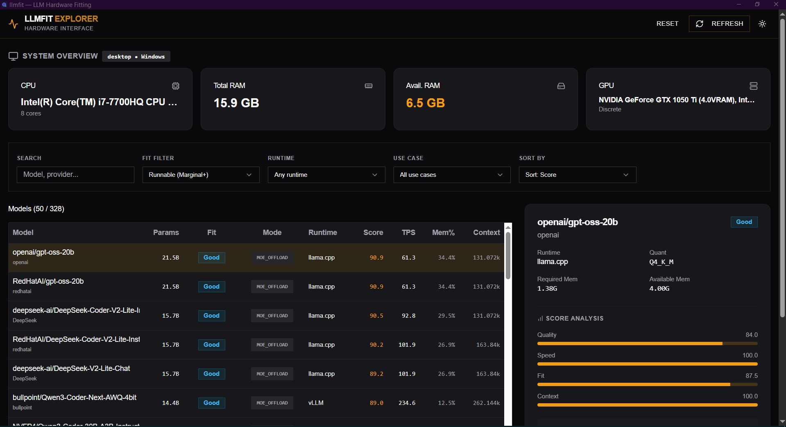
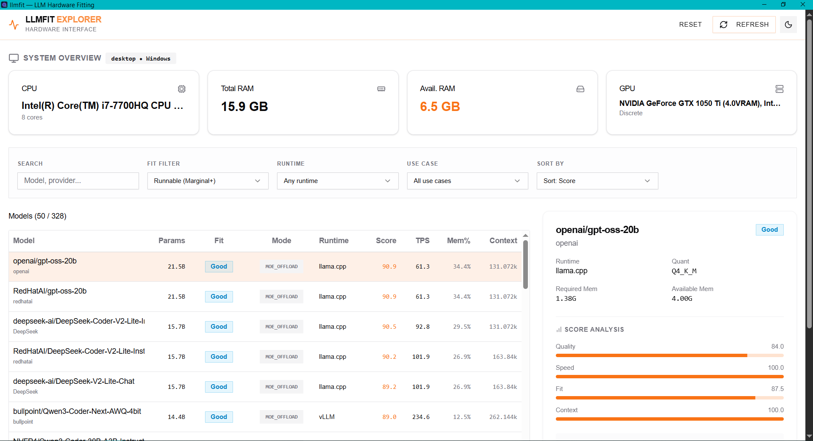

# 🚀 llmfit (Desktop Edition)

<p align="center">
  
</p>

<p align="center">
  <b>A cross-platform, industrial-grade Desktop Application to right-size LLM models against your hardware.</b>
</p>

<p align="center">
  <a href="https://github.com/Kcguner/llmfit/releases">
    
  </a>
  
</p>

> 🎨 **Desktop UI/UX Remastered & Engineered by [@Kcguner](https://github.com/Kcguner)**  
> *(Powered by the original CLI/TUI core from [AlexsJones](https://github.com/AlexsJones/llmfit))*

---

## 🌟 What's New in this Version?

This fork introduces a **fully native, standalone Desktop GUI** built with Tauri, React, and TailwindCSS. We completely overhauled the previous CLI-centric experience into a beautifully designed, "Industrial & Precise" interface suitable for professional hardware profiling.

- **Zero-Config Desktop Native:** No more terminal commands required. Just double-click the installer and launch your GUI.
- **Industrial Dark Palette:** A sleek Zinc/Amber structural theme optimized for dense data tables, sharp geometry, and high-readability fonts (`Chivo` and `JetBrains Mono`).
- **Cross-Platform OS Installers:** Automated CI/CD pipelines generate `.exe`, `.msi`, `.dmg`, `.deb` installers dynamically via GitHub Actions on every release.
- **High-Performance React Engine:** Fully decoupled data streams with fast debounced searching, sticky floating headers, and dynamic MoE offload metrics visualization without frame drops.

### 📸 Interface Previews

**Dark Mode (Industrial Engine)**  


**Light Mode (Clean & Precise)**  


---

## 🖥️ Install Desktop App (GUI)

The easiest way to use **llmfit** is by downloading the standalone Application. 

1. Go to our **[Releases](https://github.com/Kcguner/llmfit/releases)** page.
2. Download the installer for your operating system:
   - **Windows:** Download `.msi` or `.exe`
   - **macOS:** Download `.dmg` or `.app.tar.gz`
   - **Linux:** Download `.deb` or `.AppImage`
3. Run the installer and you're good to go!

---

## 💻 Command Line (CLI / TUI)

*(The original core terminal implementation is still fully intact and functional!)*

### Windows
```sh
scoop install llmfit
```

### macOS / Linux
#### Homebrew
```sh
brew install llmfit
```
#### Quick install
```sh
curl -fsSL https://llmfit.axjns.dev/install.sh | sh
```

---

## 🛠️ How it works (Core Engine)

1. **Hardware detection:** Automatically reads total/available RAM, counts CPU cores, and probes for GPUs (NVIDIA, AMD, Intel, Apple Silicon).
2. **Model database:** Cross-references hundreds of LLM models and detects MoE (Mixture-of-Experts) architectures to calculate precise VRAM constraints.
3. **Dynamic quantization:** Walks a hierarchy from `Q8_0` down to `Q2_K` to intelligently fit your exact memory footprint.
4. **Multi-dimensional scoring:** Analyzes models tailored specifically to *your* exact machine configuration:
   - **Quality:** Model reputation and quantization penalty.
   - **Speed:** Estimated tokens/sec based on your GPU backend.
   - **Fit:** Memory utilization efficiency.
   - **Context:** Feasible context lengths.

## 🤝 Contributing
Contributions, UI/UX enhancements, and performance PRs are always welcome. Let's make hardware profiling beautiful!

## License
MIT (Includes MIT licenses from original authors)
