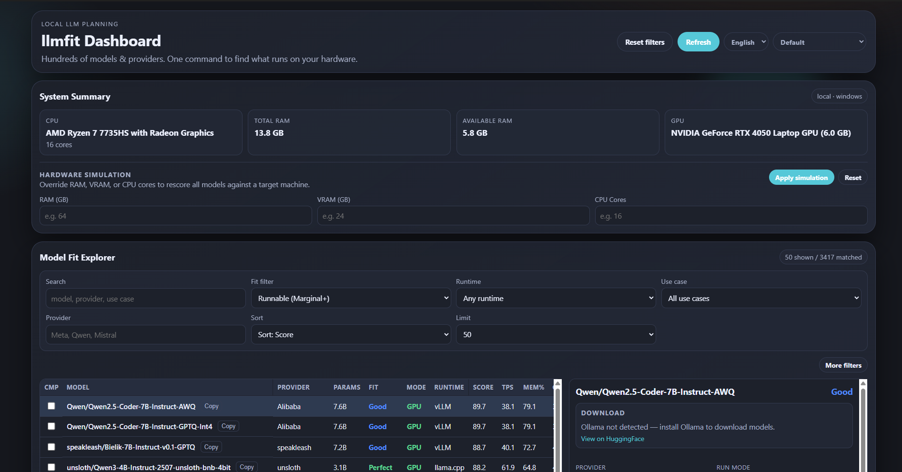

<div align="center">
<p align="center">  </p>
# llm.fit-ui

**A cross-platform desktop GUI for LLM hardware fitting**

Detect your system specs, score hundreds of models by fit, estimate hardware requirements, and download models via Ollama — all in one native desktop app.

Built with [Tauri v2](https://v2.tauri.app/) (Rust) + [React](https://react.dev/)

</div>

---

## Overview

`llm.fit-ui` is a UI-focused redesign of the original [llm.fit](https://github.com/AlexsJones/llmfit) project, packaged as a native desktop application. It answers a simple question — *"which local LLMs will actually run well on my machine?"* — with system-aware scoring, hardware simulation, and one-click downloads.

## Features

| Feature | Description |
|---|---|
| **System detection** | Reads RAM, CPU cores, GPU model/VRAM, and unified memory (Apple Silicon) |
| **Model scoring** | Ranks models by fit (Perfect → Good → Marginal → Too Tight), run mode (GPU / CPU offload / CPU-only), and estimated tokens/sec |
| **Hardware simulation** | Override RAM, VRAM, or CPU cores to test hypothetical configurations |
| **Planning** | Estimates minimum and recommended hardware for any model at a given context length |
| **One-click download** | Pulls models via Ollama with a live progress bar |
| **Side-by-side comparison** | Compare up to 5 models at once |

## Screenshots

<p align="center">  </p>

## Getting started

### Prerequisites

- [Rust](https://rustup.rs/) — edition 2024, stable toolchain, 1.85+
- [Node.js](https://nodejs.org/) 18+
- [Tauri prerequisites](https://v2.tauri.app/start/prerequisites/) for your platform:
  - **Windows** — WebView2 (bundled with Win10+), Visual Studio Build Tools with the C++ workload
  - **macOS** — Xcode Command Line Tools
  - **Linux** — `libwebkit2gtk-4.1-dev`, `libappindicator3-dev`, and related packages
- [Ollama](https://ollama.com/) — optional, required only for in-app model downloads

### Installation

```sh
# Install frontend dependencies
npm --prefix llmfit-web install

# Run in development mode
cd llmfit-desktop && cargo tauri dev

# Or build a production bundle
cd llmfit-desktop && cargo tauri build
```

### Build artifacts

| Platform | Output path |
|---|---|
| Windows | `target/release/bundle/msi/llmfit_*.msi`<br>`target/release/bundle/nsis/llmfit_*-setup.exe` |
| macOS | `target/release/bundle/dmg/llmfit_*.dmg` |
| Linux | `target/release/bundle/deb/llmfit_*.deb` |

## Project structure

```
llmfit-core/       Rust library — hardware detection, model analysis, planning
llmfit-desktop/    Tauri v2 desktop shell (Rust commands + IPC)
llmfit-web/        React 18 SPA — filtering, comparison, simulation, downloads
```

## Tech stack

| Layer | Technology |
|---|---|
| Desktop shell | Tauri v2 |
| Backend | Rust (stable, no `unsafe`) |
| Frontend | React 18 + Vite |
| GPU detection | `nvidia-smi`, `rocm-smi`, `system_profiler` |
| Model downloads | Ollama |


## Contributing

Issues and pull requests are welcome. Please open an issue before submitting large changes so we can discuss the approach first.

## Credits

This project is a UI-focused redesign built on top of [llm.fit](https://github.com/AlexsJones/llmfit) by **Alex Jones**, used under the MIT License. All core hardware-fitting logic originates from that project; this repository adds a native desktop shell and redesigned frontend on top of it.

## License

MIT — see [LICENSE](./LICENSE) for details.