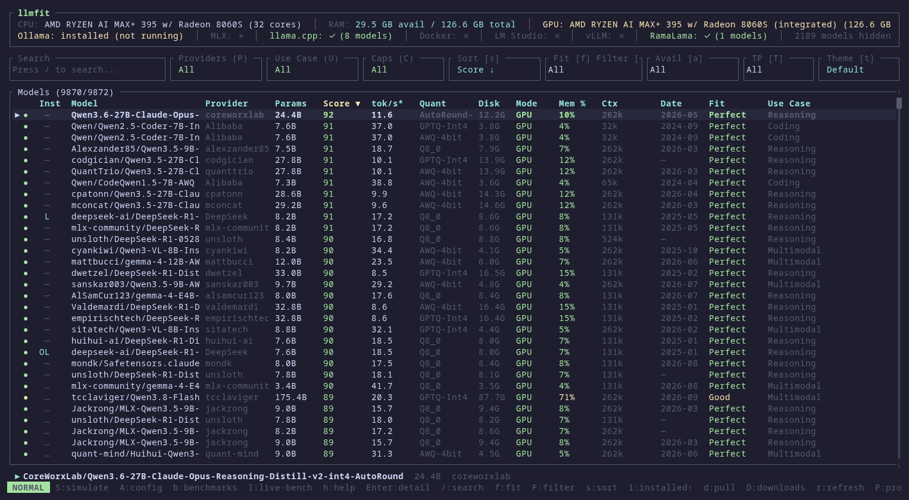

# llmfit

<p align="center">
  
</p>

<p align="center">
  <a href="README.md">English</a> ·
  <b>中文</b> ·
  <a href="README.ja.md">日本語</a>
</p>

<p align="center">
  <a href="https://github.com/AlexsJones/llmfit/actions/workflows/ci.yml"></a>
  <a href="https://crates.io/crates/llmfit"></a>
  <a href="LICENSE"></a>
  <a href="https://about.signpath.io"></a>
</p>
<p align="center">
  <a href="https://trendshift.io/repositories/21325?utm_source=repository-badge&amp;utm_medium=badge&amp;utm_campaign=badge-repository-21325" target="_blank" rel="noopener noreferrer"></a>
</p>

探索你的硬件能轻松运行哪些开源大语言模型（LLM）。`llmfit` 会检查你的 CPU、系统 RAM、GPU、显存（VRAM）以及加速器配置，推荐支持各类主流量化格式的模型。

**📊 新功能：基准测试与共享 — 来自你机器的真实数据，让所有人的估算更准确。** 下载模型、运行服务并在你的硬件上实测真实 tok/s — 然后直接从 TUI 将结果以 PR 形式贡献回项目。无需 `gh` CLI，也无需第三方账号。每次测试都会先保存在本地，你自己的实测数据会替换适配表中的估算值，每条合并的提交都会随下一个版本发布：相同硬件的用户无需自己运行基准测试，就能获得实测 `✓` 数据。[按步骤查看基准测试指南 →](docs/benchmarking.md)



## 功能特性

- **硬件自动检测**：自动检测 CPU 核心数、系统 RAM、可用的独立/集成 GPU、显存（VRAM）以及统一内存架构（NVIDIA CUDA、Apple Silicon、AMD ROCm、Intel OneAPI）。
- **模型兼容性引擎**：深入分析模型参数量、上下文长度及量化格式（GGUF、AWQ、GPTQ、EXL2），精准预估内存占用与每秒生成 Token 速度（tokens-per-second）。
- **交互式 TUI 与 Web 控制台**：可在轻量级、零依赖的终端界面与功能丰富的 Web 仪表盘之间自由选择。
- **REST API 接口**：对外暴露标准 HTTP JSON 端点（`/api/v1/system`、`/api/v1/models`），便于无缝集成至编排器、控制台和自动化部署流水线中。
- **多平台支持**：支持 macOS（Apple Silicon 与 Intel）、Linux（x86_64 与 ARM64）以及 Windows（x86_64）。
- **数百款模型与服务提供商。一条命令即可找出最适合你硬件的模型。**

一款终端工具，根据你系统的 RAM、CPU 和 GPU 为 LLM 模型匹配最合适的规格。自动检测硬件，从质量、速度、适配度和上下文四个维度为每个模型打分，告诉你哪些模型能在你的机器上流畅运行。

内置交互式 TUI（默认）和经典 CLI 模式。支持多 GPU 配置、MoE（混合专家）架构、动态量化选择、速度估算，以及本地运行时提供商（Ollama、llama.cpp、MLX、Docker Model Runner、LM Studio）。

---

## 姐妹项目

- [sympozium](https://github.com/sympozium-ai/sympozium/) — 在 Kubernetes 中管理 Agent。
- [llmserve](https://github.com/AlexsJones/llmserve) — 用于服务本地 LLM 模型的简单 TUI。选择模型、选择后端、开启服务。
- [llama-panel](https://github.com/AlexsJones/llama-panel) — 用于管理本地 llama-server 实例的原生 macOS 应用。
- [llmfit-gui](https://github.com/raiyyan729-cloud/llmfit-gui) — 适用于 llmfit 的 Windows 桌面图形界面（PowerShell + WinForms）：浏览推荐、一键下载至 LM Studio/Ollama 并执行基准测试。

---

## 文档导航

|  |  |
|---|---|
| **入门指南** | [安装](#安装) · [使用](#使用) · [工作原理](#工作原理) |
| **功能指南** | [TUI 指南](docs/tui.md) · [基准测试分步指南](docs/benchmarking.md) · [CLI 与自动化](docs/cli.md) · [运行时提供商](docs/providers.md) · [OpenClaw 集成](docs/openclaw.md) |
| **技术参考** | [完整工作原理](docs/how-it-works.md) · [平台与 GPU 支持](docs/platform-support.md) · [自定义模型](docs/custom-models.md) · [开发指南](docs/development.md) |
| **项目信息** | [参与贡献](#参与贡献) · [其他替代方案](#其他替代方案) · [代码签名](#代码签名) · [开源许可证](#开源许可证) |

---

## 安装

### Windows
```sh
scoop install llmfit
```

如果尚未安装 Scoop，请参阅 [Scoop 安装指南](https://scoop.sh/)。

### macOS / Linux

#### Homebrew

预编译二进制文件（推荐，适用于所有 macOS/Linux 版本）：
```sh
brew install AlexsJones/llmfit/llmfit
```

或通过 homebrew-core formula 安装（在无预编译 bottle 的 macOS 版本上会从源码构建）：
```sh
brew install llmfit
```

#### MacPorts
```sh
port install llmfit
```

#### 一键脚本安装
```sh
curl -fsSL https://llmfit.axjns.dev/install.sh | sh
```

从 GitHub 下载最新的发布二进制文件并安装至 `/usr/local/bin`（若无 sudo 权限则安装至 `~/.local/bin`）。

**无需 sudo 安装到 `~/.local/bin`：**
```sh
curl -fsSL https://llmfit.axjns.dev/install.sh | sh -s -- --local
```

### uv / pip
安装或更新 llmfit：
```sh
uv tool install -U llmfit
```

免安装直接运行：
```sh
uvx llmfit
```

你也可以像普通 Python 包一样使用 pip 或 uv 进行常规安装。

### 预编译二进制文件

直接从 [GitHub Releases](https://github.com/AlexsJones/llmfit/releases) 页面下载适用于 Linux、macOS 和 Windows 的发布二进制文件。仅当该版本的完整 `sign-windows` CI 任务成功（包括签名、重新打包、工件替换和校验和上传）时，Windows 二进制文件才会被数字签名；如果签名被跳过或失败，发布页面可能仍然提供未签名的 Windows 工件。如果需要已签名的二进制文件，请在运行前验证可执行文件签名。

---

## 容器化部署

`llmfit` 提供多架构 Docker 镜像（`ghcr.io/alexsjones/llmfit`），同时支持交互式 CLI/TUI 与无界面的 Web UI / API 服务器模式。

### 交互式 TUI

如需启动交互式 TUI 界面，请传入全局 `--tui` 参数：

```sh
docker run -it --rm ghcr.io/alexsjones/llmfit --tui
```

### 非交互式模式

直接输出 `llmfit recommend` 命令的 JSON 格式结果：

```sh
docker run ghcr.io/alexsjones/llmfit
```

该命令会输出 `llmfit recommend` 的 JSON 结果，可结合 `jq` 进一步查询过滤：
```sh
podman run ghcr.io/alexsjones/llmfit recommend --use-case coding | jq '.models[].name'
```

### 从源码构建
```sh
git clone https://github.com/AlexsJones/llmfit.git
cd llmfit
cargo build --release
# 二进制文件位于 target/release/llmfit
```

---

## 使用

### 终端交互界面 (TUI)

在终端中不带任何参数直接运行 `llmfit` 即可启动交互式模型浏览器：

```sh
llmfit          # 交互式 TUI：检测你的硬件，并对所有模型进行评分排名
```

TUI 界面顶部会显示检测到的硬件配置，并针对每个模型从适配度、速度、质量和上下文四个维度进行打分。有关导航、规划、模拟、下载、社区排行榜和基准测试的说明，请参阅 [TUI 指南](docs/tui.md)。

TUI 常用快捷键：
- `b`：打开社区基准测试；`I`：打开实时推理基准测试
- `h`：显示帮助与快捷键列表
- `↑` / `↓` 或 `k` / `j`：在列表中上下导航
- `/`：按名称、模型家族或量化格式过滤模型
- `Esc`：清除搜索 / 返回上一级

### 命令行选项 (CLI)

```sh
# 将硬件遥测信息和推荐模型打印至标准输出
llmfit recommend

# 以原始 JSON 格式输出系统画像与推荐结果
llmfit recommend --json

# 估算保留 3 个可运行模型所需的 SSD 磁盘容量
llmfit storage --keep 3 --selection largest --json

# 启动原生 HTTP API 服务器
llmfit serve --host 0.0.0.0 --port 8787
```

有关模型选择策略、系统保留空间、下载临时缓存、可用空间余量及硬件模拟，请参阅[模型库存储规划](docs/cli.md#model-library-storage)。

### Web 界面与 API 服务器

```sh
docker run -d -p 8787:8787 ghcr.io/alexsjones/llmfit serve
```

#### Docker Compose

```yaml
---
services:
  llmfit:
    image: ghcr.io/alexsjones/llmfit:latest
    container_name: llmfit
    restart: unless-stopped
    command: ["serve", "--host", "0.0.0.0", "--port", "8787"]
    ports:
      - "8787:8787"
    healthcheck:
      test: ["CMD", "curl", "-f", "http://localhost:8787/health"]
      interval: 15s
      timeout: 5s
      retries: 3
      start_period: 10s
```

适用于脚本、Agent 和经典终端输出：

```sh
llmfit recommend              # 标准输出：硬件检测 + 最佳推荐表格
llmfit recommend --json       # 以 JSON 格式输出推荐（供 Agent/脚本调用）
llmfit info "<model>"         # 单个模型：适配分析、估算依据、验证命令
llmfit bench                  # 针对当前运行的提供商实测真实 tok/s 和 TTFT
llmfit doctor                 # 硬件检测报告（用于提交 Issue 诊断）
llmfit serve                  # 启动 API 与 Web 用户界面
```

完整参考：[CLI 与自动化](docs/cli.md)。

---

## 社区与基准测试

`llmfit` 汇集了社区用户贡献的硬件检测与性能基准测试数据。你可以使用以下命令分享你的硬件实测结果：

```sh
llmfit bench --share
```

---

## 工作原理

llmfit 会检测你的系统硬件（RAM、CPU、GPU/显存、后端），然后根据四个维度对目录中的每个模型进行评分：内存适配度、预估速度、质量和上下文。速度估算基于内存带宽模型，并结合运行时采样与真实社区实测数据进行校准 — 每个估算值都会提供输入依据，因此 `llmfit info` 可以准确展示估算所采用的假设参数以及如何在你的机器上进行验证。

详细信息（包含估算公式和模型数据库）：请参阅 [llmfit 工作原理](docs/how-it-works.md)。

---

## 参与贡献

欢迎大家参与贡献，尤其是添加新模型支持。

### 提交 PR 前

在提交更改前，请先运行 `cargo fmt`。CI 检查失败的大多数原因都是代码格式问题：

```sh
cargo fmt
```

添加模型指南（本地免重新构建添加，或添加到内置目录）：请参阅 [自定义模型](docs/custom-models.md)。

---

## 其他替代方案

如果你正在寻找不同的实现方式，可以看看 [llm-checker](https://github.com/Pavelevich/llm-checker) —— 一个集成了 Ollama 的 Node.js CLI 工具，可以直接拉取并对模型进行基准测试。它采取了更实操的方式，即直接在你的硬件上通过 Ollama 实际运行模型，而不是纯根据规格进行预估。如果你已经安装了 Ollama 并且想测试实际运行表现，这是一个不错的选择。需要注意的是，它不支持 MoE（混合专家）架构 —— 所有模型均被视为密集模型（Dense），因此像 Mixtral 或 DeepSeek-V3 这种模型的内存预估将反映总参数量，而非较小的活跃参数子集。

---

## 代码签名

llmfit 的 Windows 发布二进制文件旨在通过 [SignPath.io](https://about.signpath.io/) 进行数字签名（Authenticode），免费代码签名证书由 [SignPath Foundation](https://signpath.org/) 提供。仅当特定版本的完整 `sign-windows` 任务成功（包括签名、重新打包、工件替换和校验和上传）时，该版本才会被签名；如果签名被跳过或失败，发布中仍可能发布未签名的工件。在使用前请验证可执行文件签名。

签名过程在[发布工作流](.github/workflows/release.yml)中自动进行：仅对由 GitHub Actions 在本仓库构建的工件提交签名，且签名请求需由项目维护者（[@AlexsJones](https://github.com/AlexsJones)）审批。

**代码签名政策：** 请参阅 [SignPath Foundation 代码签名政策与条款](https://signpath.org/terms)。

**隐私说明：** 除非用户或安装/操作人员明确请求，本程序不会向其他网络系统传输任何信息。llmfit 仅在您明确使用相应功能（例如下载模型、查询运行时提供商或访问社区排行榜）时才会连接外部服务。

---

## 开源许可证

MIT

---

> 💡 **文档维护说明**：本中文文档由社区志愿者（@JasonYeYuhe）翻译维护，最后同步更新于 2026年10月4日。如发现内容与官方英文原版存在差异或新特性滞后，欢迎提交 PR 共同完善！
